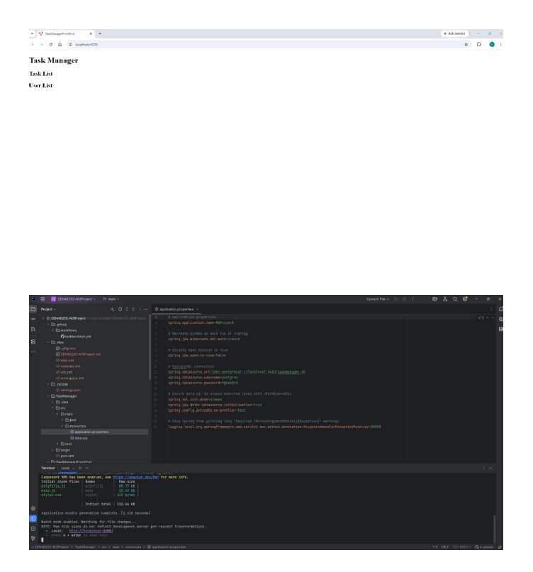

# CEN4025C-M3Project

## Module 3 - Angular HttpClient Integration

### Project Overview

This project connects the Angular TaskManager frontend to the Spring Boot backend using Angular HttpClient. The frontend retrieves data from RESTful REST API endpoints and displays tasks, users, and subtasks.

## Technologies Used

- Angular 19
- TypeScript
- Spring Boot
- Java 17
- REST API
- Angular HttpClient
- H2 Database

## Features

- Retrieve Tasks from the Spring Boot backend
- Retrieve Users from the Spring Boot backend
- Retrieve Subtasks from the Spring Boot backend
- Display task and user data in Angular components
- RESTful API integration using Angular HttpClient

## REST API Endpoints

| Method | Endpoint | Description |
|--------|----------|-------------|
| GET | `/tasks` | Retrieve all tasks |
| GET | `/users` | Retrieve all users |
| GET | `/subtasks` | Retrieve all subtasks |

## Running the Application

### Start the Spring Boot Backend

Run the Spring Boot application.

The backend will start on:

```
http://localhost:8080
```

### Start the Angular Frontend

Open a terminal in the `TaskManagerFrontEnd` folder and run:

```bash
ng serve
```

Then open:

```
http://localhost:4200
```

## Sample Output

### Task List

- Task 1
- Task 2
- Task 3
- Task 4
- Task 5
- Task 6
- Task 7
- Task 8
- Task 9
- Task 10

### User List

- alice
- bob
- carol
- dave
- eve

## Screenshot

The application successfully retrieves data from the Spring Boot backend.



## Assignment Summary

This project demonstrates:

- Angular HttpClient
- Spring Boot REST API Integration
- Displaying Tasks
- Displaying Users
- Displaying Subtasks
- Communication between Angular and Spring Boot